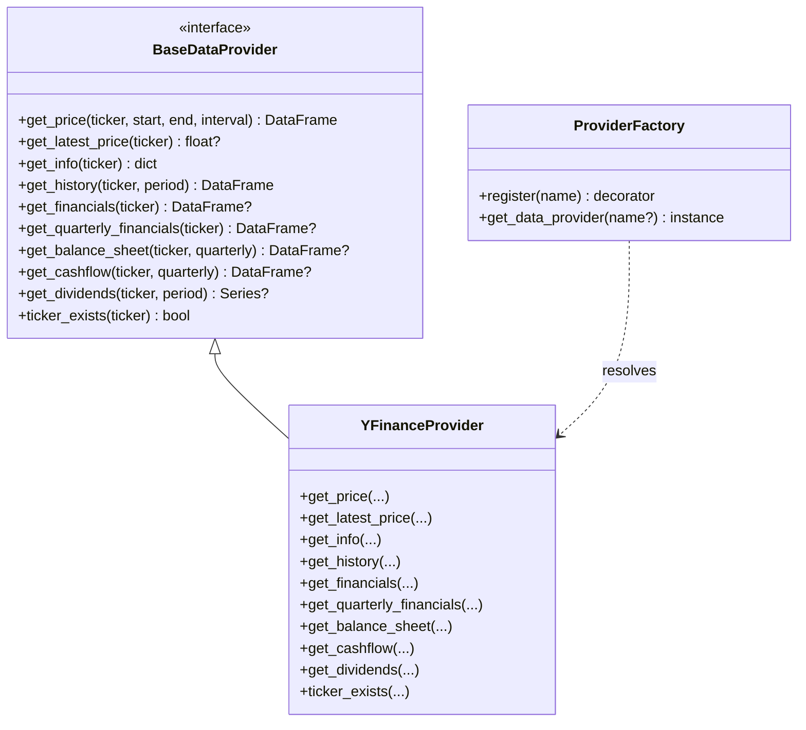

# Data Provider Architecture

## Overview

All market-data access in AlphaSentra flows through a single abstraction layer.
This lets you swap the underlying data source (e.g. yfinance, Alpha Vantage,
Polygon, etc.) without touching any downstream analysis or model code.



## How to switch providers

1. Add a new adapter in `data/providers/<name>_provider.py` that implements `BaseDataProvider`.
2. Decorate it with `@register("<name>")`.
3. Change `DATA_PROVIDER` in `_config.py` (or set the env var).

```python
# data/providers/<name>_provider.py
from data.provider_factory import register
from data.provider_interface import BaseDataProvider

@register("<name>")
class MyProvider(BaseDataProvider):
    ...
```

```python
# _config.py
DATA_PROVIDER = "yfinance"       # or "<name>"
```

## File locations

```
data/
├── provider_interface.py      # BaseDataProvider abstract class
├── provider_factory.py        # @register() + get_data_provider()
├── providers/
│   ├── __init__.py
│   └── yfinance_provider.py   # Current yfinance adapter
```

## Current coverage

The following modules no longer import yfinance directly and instead obtain data through the provider:

- `data/price.py`
- `data/price_action.py`
- `data/treasury_yield_utils.py`
- `data/check_ticker.py`
- `data/tickers_01_performance_filter.py`
- `data/tickers_02_metrics_collection.py`
