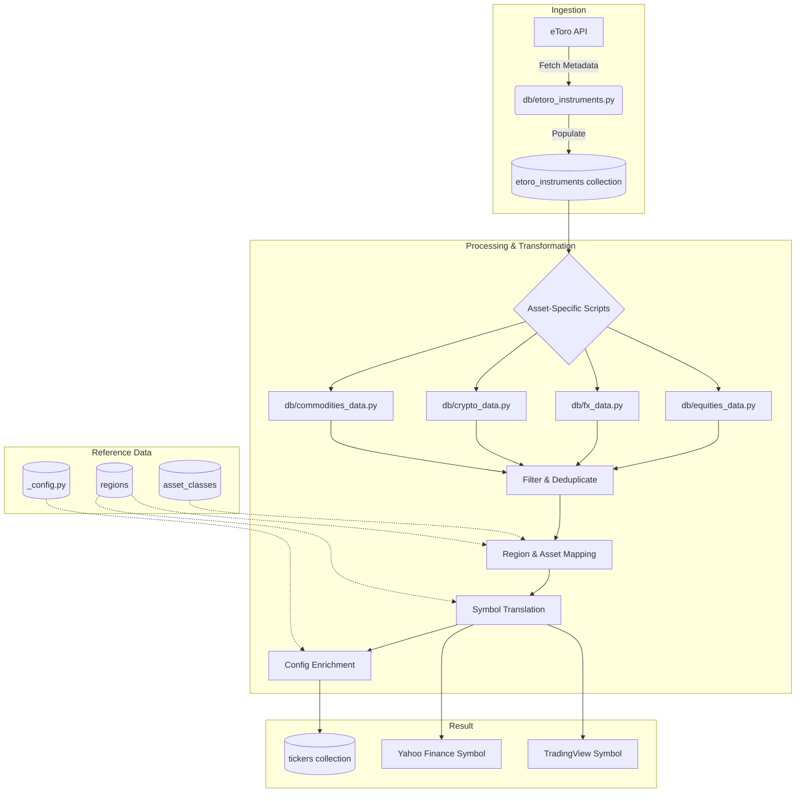

# eToro Data Mapping Documentation

This document describes how eToro instrument metadata is mapped to asset classes, regions, exchanges, and external platforms (Yahoo Finance and TradingView) within the AlphaSentra-core system.

## Data Flow Overview

## eToro Asset Class Identification

When pulling data from the eToro API, the `etoro_instrumentTypeId` is used to identify the instrument's asset class. The `asset_classes` collection stores this mapping.

### Collection: `asset_classes`

| etoro_instrumentTypeId | code | description |
|:---:|:---:|:---|
| 1 | FX | Forex |
| 5 | EQ | Equities |
| 6 | ETF | ETFs |
| 4 | IX | Indices |
| 2 | CO | Commodities |
| 10 | CR | Crypto |

**Usage:** Join the `etoro_instruments` collection with `asset_classes` using the `etoro_instrumentTypeId` field to determine the asset category.

---

## eToro Exchange & Region Mapping

The `regions` collection is used to map eToro's `etoro_exchangeID` to specific geographical regions, exchange names, and symbol formatting requirements for external platforms.

### Collection: `regions`

| eToro exchangeID | Region | Exchange Name | Yahoo Code | TradingView Code |
|:---:|:---|:---|:---:|:---|
| 1 | Global | FX | `=X` | |
| 2 | Global | Commodity | | |
| 3 | Global | Indices (CFD) | `^` | `INDEX:` |
| 4 | US | Nasdaq | | `NASDAQ:` |
| 5 | US | NYSE | | `NYSE:` |
| 6 | Germany | Frankfurt (Xetra) | `.DE` | `XETR:` |
| 7 | UK | London | `.L` | `LSE:` |
| 8 | Global | Crypto | `-USD` | `USD` |
| 9 | France | Paris | `.PA` | `EURONEXT:` |
| 10 | Spain | Madrid | `.MC` | `BME:` |
| 11 | Italy | Borsa Italiana | `.MI` | `MIL:` |
| 12 | Switzerland | Zurich | `.SW` | `SIX:` |
| 14 | Norway | Oslo | `.OL` | `OSL:` |
| 15 | Sweden | Stockholm | `.ST` | `OMXSTO:` |
| 16 | Denmark | Copenhagen | `.CO` | `OMXCOP:` |
| 17 | Finland | Helsinki | `.HE` | `OMXHEX:` |
| 20 | US | Chicago (CME/CBOT) | | `CME:` |
| 21 | Hong Kong | Hong Kong | `.HK` | `HKEX:` |
| 22 | Portugal | Lisbon | `.LS` | `EURONEXT:` |
| 23 | Belgium | Brussels | `.BR` | `EURONEXT:` |
| 24 | Saudi Arabia | Tadawul | `.SR` | `TADAWUL:` |
| 30 | Netherlands | Amsterdam | `.AS` | `EURONEXT:` |
| 31 | Australia | ASX (Sydney) | `.AX` | `ASX:` |
| 32 | Austria | Vienna | `.VI` | `VIE:` |
| 33 | Ireland | Dublin | `.IR` | `EURONEXT:` |
| 34 | Global | ETFs (CFD) | | `AMEX:` |
| 38 | Germany | Xetra ETFs | `.DE` | `XETR:` |
| 39 | UAE | Dubai | `.DU` | `DFM:` |
| 40 | Global | Commodities | `=F` | `COMEX:` |
| 41 | UAE | Abu Dhabi | `.AD` | `ADX:` |
| 42 | UK | LSE AIM | `.L` | `LSE:` |
| 56 | Japan | Tokyo | `.T` | `TSE:` |

---

## Ticker Import Process

The system automates the promotion of instruments from the raw `etoro_instruments` collection to the active `tickers` collection using specialized scripts for each asset class.

### 1. Raw Data Ingestion
The `db/etoro_instruments.py` script fetches the latest metadata from the eToro API and overwrites the `etoro_instruments` collection.

### 2. Transformation & Filtering
Specific scripts (e.g., `db/equities_data.py`, `db/fx_data.py`, etc.) perform the following transformations to populate the `tickers` collection:

- **Filtering:** Only non-internal instruments (`isInternalInstrument: false`) matching the relevant `instrumenttypeID` are processed.
- **Deduplication:** The script checks if `ticker_etoro` already exists in the `tickers` collection before inserting.
- **Region Resolution:** The `exchangeID` from the eToro document is cross-referenced with the `regions` collection to assign a geographical region.
- **Symbol Translation:** The `helpers.get_ticker_exchange_mapping()` function is called to generate platform-specific symbols for Yahoo Finance and TradingView based on the exchange mapping.
- **Config Enrichment:** Prompts, factor models, and model functions are assigned based on the asset class (defined in `_config.py`).

### Asset-Specific Scripts
| Asset Class | Script | Key Logic |
|:---|:---|:---|
| Equities/ETFs | `db/equities_data.py` | Maps exchange IDs to regions; handles both EQ and ETF types. |
| FX | `db/fx_data.py` | Sets 4 decimal places; assigns `run_fx_model`. |
| Crypto | `db/crypto_data.py` | Sets Global region; uses suffix mapping for TradingView. |
| Commodities | `db/commodities_data.py` | Categorizes into Energy (EN), Agriculture (AG), or Metals (ME) based on keywords in the symbol name. |

---

## Symbol Construction Logic

The `regions` collection enables the translation of eToro base symbols to other platforms via the `get_ticker_exchange_mapping` helper:

### 1. Yahoo Finance (yfinance)
- **Forex:** `SYMBOL + yahoo_finance_exchange_code` (e.g., `EURUSD=X`)
- **Indices:** `yahoo_finance_exchange_code + SYMBOL` (e.g., `^GSPC`)
- **Commodities:** `SYMBOL + yahoo_finance_exchange_code` (e.g., `GC=F`)
- **Equities:** `SYMBOL + yahoo_finance_exchange_code` (e.g., `SAP.DE`, `BP.L`)
- **Crypto:** `SYMBOL + yahoo_finance_exchange_code` (e.g., `BTC-USD`)

### 2. TradingView
- **Equities/Indices:** `tradingview_exchange_code + SYMBOL` (e.g., `NASDAQ:AAPL`, `INDEX:SPX`)
- **Crypto:** `SYMBOL + tradingview_exchange_code` (e.g., `BTCUSD`)

## Implementation Details
The source of truth for the initial mapping data is defined in [`db/create_mongodb_db.py`](db/create_mongodb_db.py). The orchestration of the import process is managed by the `create_alphasentra_database` function in the same file.
