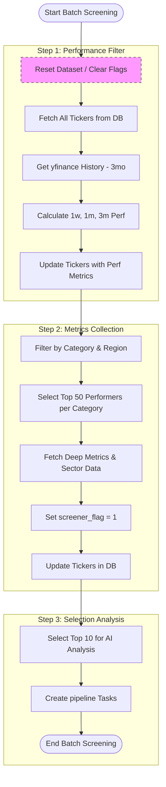

# Batch Screening Process Documentation

The `batch_screening.py` script orchestrates a multi-step data collection and analysis workflow to identify high-potential financial instruments (Equities, Forex, and Crypto) from the database and prepare them for detailed analysis models.

## Concept Overview

The screening process is designed to filter thousands of potential tickers into a manageable list of "top performers" based on recent performance (1-week, 1-month, 3-month) and fundamental metrics (EPS growth for growth stocks, dividend yield for income stocks, volume trends for crypto and forex).

### Key Components

1.  **Performance Filtering ([`data/tickers_01_performance_filter.py`](data/tickers_01_performance_filter.py)):**
    *   Retrieves all tickers from the `tickers` collection.
    *   Fetches 3 months of historical data for each ticker via `yfinance`.
    *   Calculates 1-week, 1-month, and 3-month performance percentages.
    *   Updates the `tickers` collection with these performance metrics.

2.  **Metrics Collection ([`data/tickers_02_metrics_collection.py`](data/tickers_02_metrics_collection.py)):**
    *   Filters tickers into categories (Growth Equities, Income Equities, Crypto, Forex).
    *   Sorts and retrieves the **top 50** tickers in each category based on performance.
    *   Fetches deep metrics like Forward P/E, Sector, Momentum Spread, and Volume Change.
    *   **Crucial:** Sets the `screener_flag` to `1` for these selected top 50 tickers, signaling they are active candidates for analysis.

3.  **Selection Analysis ([`data/tickers_03_selection_analysis.py`](data/tickers_03_selection_analysis.py)) *(Optional/Phase 3)*:**
    *   Further narrows down the list to the **top 10** for each category.
    *   Inserts task documents into the `pipeline` collection to trigger actual AI insights generation via [`batch/batch_run.py`](batch/batch_run.py).

## Workflow Flowchart

## `screener_flag` Management

The `screener_flag` is used to differentiate between general tickers in the database and those that have recently qualified as top performers through the screening process.

*   **Setting:** The flag is set to `1` in [`data/tickers_02_metrics_collection.py`](data/tickers_02_metrics_collection.py) during the metrics update phase.
*   **Resetting:** Currently, the `screener_flag` is **not** reset within the `batch_screening.py` script. It must be reset manually or via the orchestration menu by running [`batch/reset_dataset.py`](batch/reset_dataset.py), which executes the `reset_screener_flags()` function.

> **Recommendation:** To ensure the flag always reflects the *current* screening run, consider adding a call to `reset_screener_flags()` at the beginning of `run_batch_screening()`.
